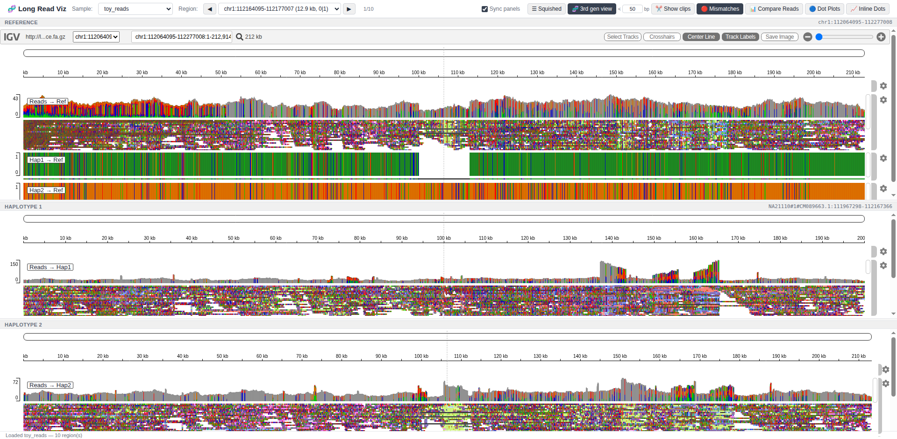
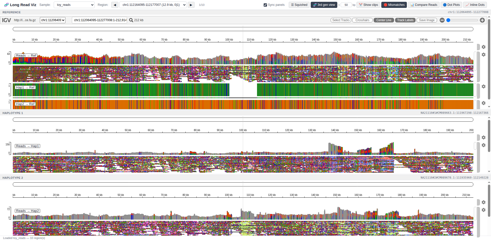
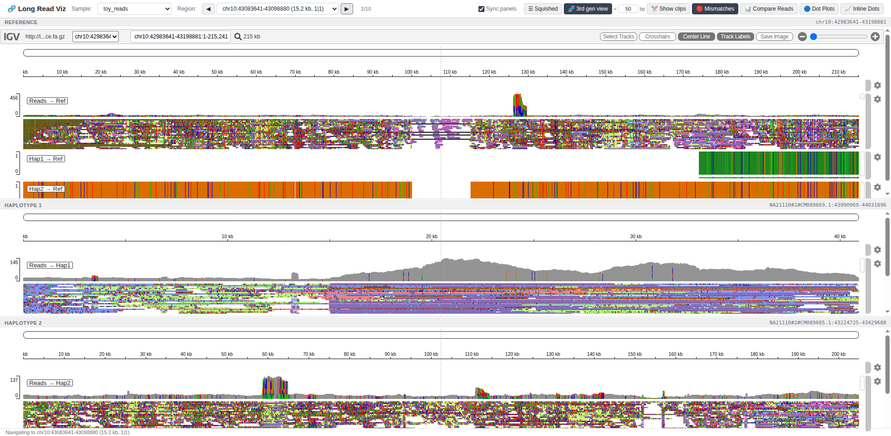
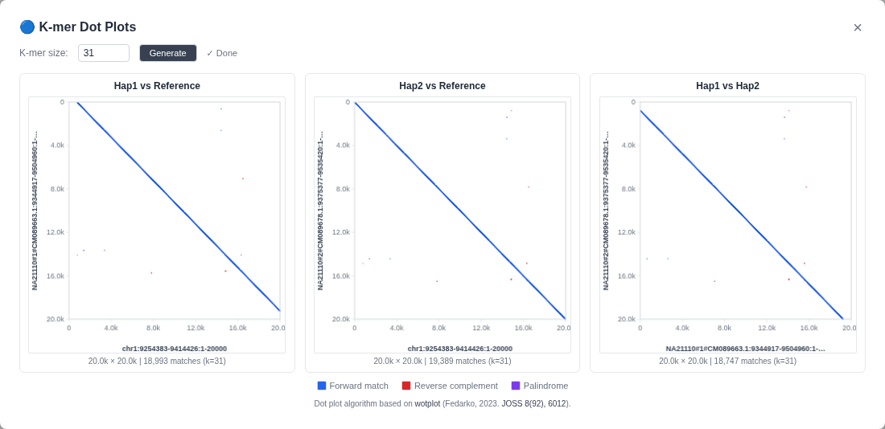

# Long Read Visualization — User Guide

> Auto-generated on 2026-03-25 19:29 UTC

## Overview

The multi-panel IGV.js visualization server displays long-read
sequencing data across three coordinated panels: **Reference**,
**Haplotype 1**, and **Haplotype 2**.  The server supports both
BAM and CRAM read formats.

## Features

| Feature | Description |
|---------|-------------|
| **Three coordinated panels** | Reference, Haplotype 1, and Haplotype 2 each have their own IGV.js browser instance |
| **Synchronized navigation** | Navigate in the reference panel and both assembly panels follow via coordinate translation |
| **Region-of-interest browsing** | Step through SV regions with ◀/▶ buttons or keyboard shortcuts |
| **BAM & CRAM support** | Reads can be loaded from BAM or CRAM files; CRAM files use the panel reference for decoding |
| **Long-read display mode** | Spurious small indels are hidden by default (threshold ≤ 3 bp), matching Java IGV behavior |
| **Haplotype colouring** | Reads are coloured by haplotype phase (HP tag): green for hap1, orange for hap2, grey for ambiguous — sorted by haplotype for visual clarity |
| **Squished display** | Reads default to squished (compact) view for better overview; toggle to expanded with one click |
| **Byte-range HTTP** | Full support for HTTP Range requests enabling efficient BAM/CRAM random access |
| **Containerized** | Run via Apptainer/Docker with the same image used for the pipeline |

## Display Controls

The toolbar provides quick-access toggle buttons:

- **☰ Squished / ≡ Expanded** — Switch between compact and full-height read display
- **🧹 Hide indels / 🔍 Show indels** — Toggle suppression of spurious small indels (≤ 3 bp)
- **Sync panels** — Enable/disable cross-panel coordinate synchronization

## Keyboard Shortcuts

| Key | Action |
|-----|--------|
| `←` or `[` | Previous region |
| `→` or `]` | Next region |

## Screenshots

### Main View

The multi-panel IGV.js interface on initial load, showing the sample selector, region navigation controls, and three synchronized genome-browser panels (Reference, Haplotype 1, Haplotype 2).

### SV Region View

Navigated to the first structural-variant region of interest. Reads are displayed in squished mode, assembly-to-reference alignments appear as colored tracks, and the locus is shown in each panel header.

### Second Region

After pressing ▶ to advance to the next SV region. All three panels update simultaneously via server-side coordinate translation.

### Dot Plots

---

*This document is auto-generated by `scripts/generate_docs.py`.*
